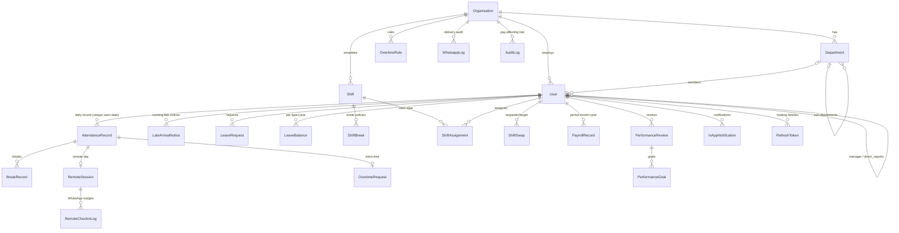
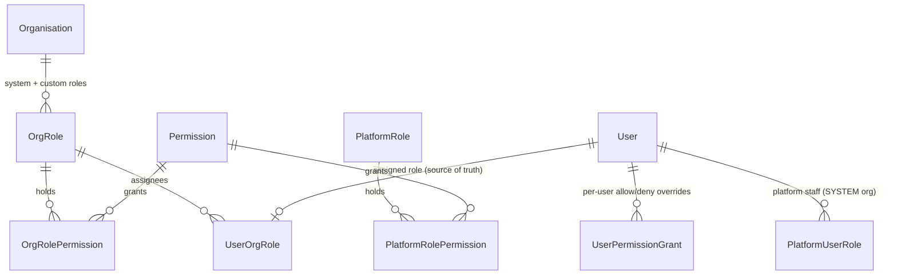

# Database Schema

33 models, PostgreSQL, Prisma 7. Source of truth: `prisma/schema.prisma`.
Migrations: append-only SQL in `prisma/migrations/`, registered in
`scripts/migrate.js`, applied idempotently at container start.

Conventions: UUID string PKs · `created_at` defaults · org scoping via
`org_id` FK on every tenant entity (handlers always filter by
`req.user.org_id`) · soft delete on `users.deleted_at` · money-affecting
mutations mirrored to `audit_logs` (append-only) · statuses as constrained
strings validated at the zod boundary.

## Core domain

## RBAC (dynamic; `users.role` is a denormalized mirror only)

Effective org permissions = assigned role's keys (fallback: legacy-role map
when unassigned) ∪ `allow` grants − `deny` grants. Platform permissions come
from `PlatformUserRole` (fallback: full `platform.*` set for legacy
`role=platform_admin` users with no assignments).

## SaaS layer

`PlanDefinition` (features JSON, pricing, trial days) → `Organisation.plan`
+ `features_override` → resolved per-request by `resolveOrgFeatures` and
gated by `requireOrgFeature`. `BlogPost` backs the public site CMS.

## Key attendance columns worth knowing

`AttendanceRecord`: `check_in_at/out_at`, `check_in_type`
(auto_ip|qr|manual|remote), `status` (in|late|out|absent|leave|remote),
`late_minutes`, `early_out_minutes`, `net_hours_worked`, `break_minutes`,
`extra_office_minutes`, `auto_checked_out`, `last_heartbeat_at`,
`challenge_sent_at` (FCM presence challenge), `is_overridden` +
`override_reason` (audited). `Organisation` tuning:
`late_threshold`, `heartbeat_grace_mins`, `gap_forgiveness_mins`,
`payroll_day`, `tax_rate`, `pension_rate`, `totp_required`.
